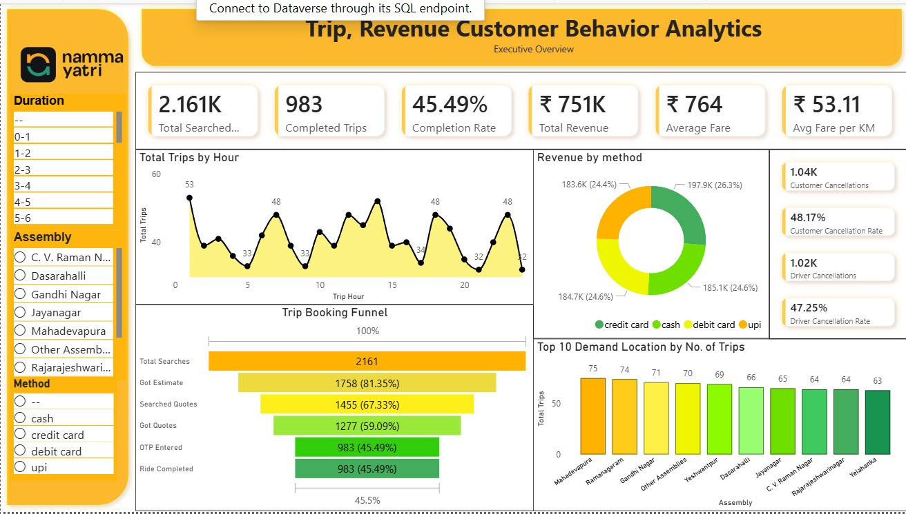

# NammaYatry Trip Revenue and Customer Behavior Analysis
CAPSTONE Project on NamaYatry datasets using Excel, SQL, Power BI, and Python

📊 Data Analytics Project
Overview

This project demonstrates an end-to-end data analytics workflow — from raw dataset ingestion to insights communication through dashboards and presentations. It covers data loading in Python, exploratory data analysis (EDA), data cleaning, SQL querying in MySQL, dashboard creation, and reporting.

The goal of the project is to transform raw data into actionable insights and present them in a clear, business-friendly format.

Size- NammaYatry created total 5 datasets these are-

      Duration(24 Rows, 2 Columns)
      
      Assembly(37 Rows, 2 Cloumns)
      
      payment(4 Rows, 2 Columns)
      
      Trip_Details(2161 Rows, 10 Columns)
      
      Trips(983 Rows, 9 Columns)

Tools & Technologies

Python — Data loading & preprocessing

Pandas

NumPy

Matplotlib / Seaborn

MySQL — SQL querying & analysis

Power BI / Power Dashboard — Data visualization

Microsoft Word — Presentation creation

Jupyter Notebook — Analysis environment

Git/GitHub — Version control

Project Steps
1. Data Loading

Imported dataset into Python using Pandas

Checked data types and handling missing values 

Created SQL connection code

2. Exploratory Data Analysis (EDA)

Conversion Funnel Leakage

Weak Fare-Distance Correlation

Geographic Hotspots

Payment Method Nuances

Trip Completion & OTP Entry

Strategic Recommendations 

3. SQL Analysis

Loaded cleaned data into MySQL

Executed analytical SQL queries

Aggregations and joins

Performance metrics extraction

4. Dashboard Creation

Built interactive Power Dashboard

Visualized KPIs and trends

Filters and drill-down insights

5. Reporting & Presentation

Generated analytical report

Converted insights into a structured presentation using Microsoft Word

Focused on business storytelling

Dashboard

The dashboard highlights:

Real-time KPI monitoring 

Funnel optimization 

Revenue targeting

Location-based forecasting

Results & Insights

Improve the user journey 

Refine pricing strategies

Deploy drivers strategically

Customize promotions and payment options

Leverage Power BI dashboards for continuous monitoring

This integrated analysis reveals key operational and behavioral 
insights. By addressing conversion bottlenecks, pricing inefficiencies, and location-based 
demand, NammaYatri can enhance user satisfaction, optimize revenue, and strengthen its 
market position.

Author

Paramita Mondal
Data Analyst | Python | SQL | Excel | Power BI
